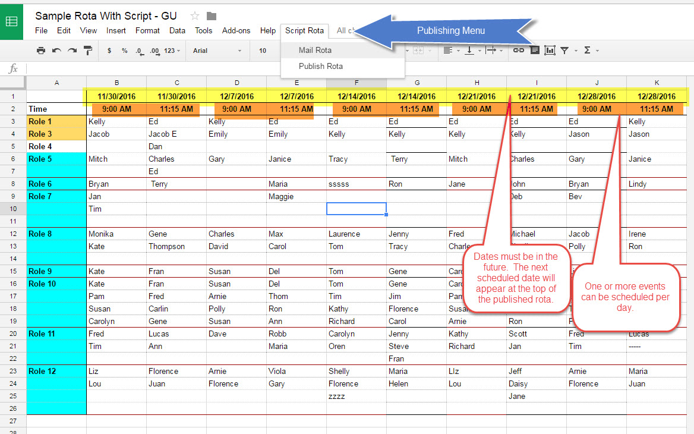
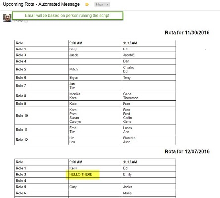

# OnlineRota_GoogleAppsScript
This code designs a volunteer assignment application.  Changes are made in a spreadsheet.

Updates are published to the web and sent by email.

## Sample Code
This will create a rota e-mail reminder and publish to Google Sites as a webpage
- [Sample Google Sheet with Embedded Script](https://docs.google.com/spreadsheets/d/1T_AnSoz893QY1IL9uH9L8mH220Wp6WE_Weaq3VkxOX4/edit#gid=0)
- [Sample Published Page from Spreadsheet](https://sites.google.com/site/terrywbradyexamples/rotasearch)

Try it yourself
- Select "Make a Copy" to save an editable copy
- Set up google site to which you have write permission
  - Create a google site page for publishing the rota
- Set Google Sites Script Properties to control how the rota will be published
  - siteid   REQUIRED.  The URL to the Google Site to which the rota will be published.  
  - emailid  The email recipient to use for sending out the published rota.  If not set, the spreadsheet owner will be used.
  - pageId   The page name (within the google site) to which the rota will be published.  If not set, "rotasearch" will be used.
- Create a trigger to call "sendRota" on a daily basis

## Screen Shots

